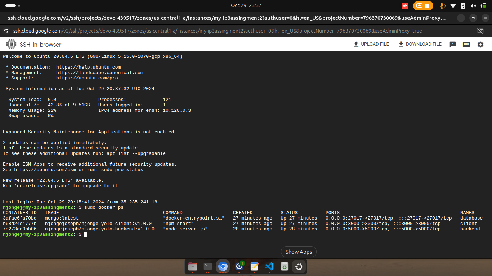
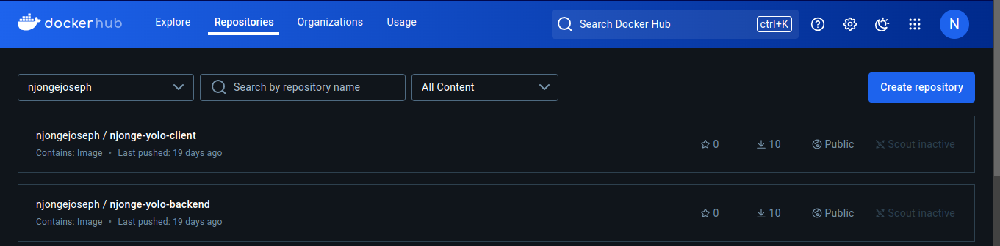
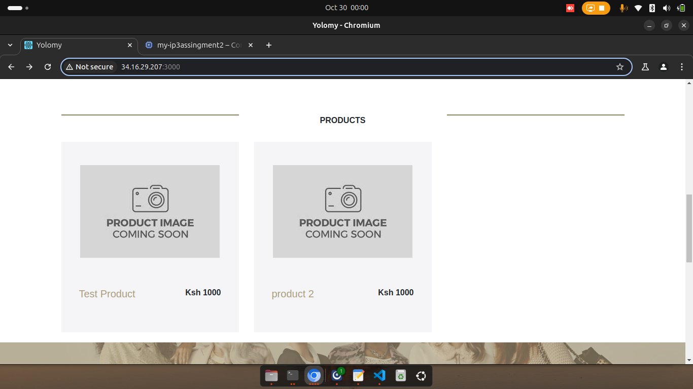
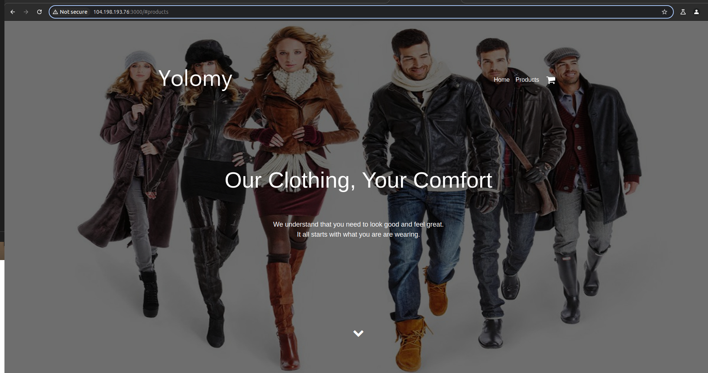

# Overview
This project involved the containerization and deployment of a full-stack yolo application using Docker.
The project uses ansible and terraform to configure and manage infrastructure on Google Cloud (GCP)

# Set up steps
1. create sub-directory named stage_two to hold directories for ansible and terraform
2. Setup required files, ie main.tf,variables.tf,terraform.tfvars for terraform 

# Configure and provision infrastructure
1. After having correct configurations ;
2. Run terraform init on your terminal to Initialize Terraform and download required provider, 
  terraform plan to review what changes will be made.
  terraform apply to Apply the changes to your infrastructure.

# Created VM in GCP
# Successful provisioned infrastrure with terraform

# Created VM in GCP console

## We are pulling the images from docker-hub (The steps to follow to create the docker images and push to diocker hub is listed below:)

# Requirements
Install the docker engine here:
- [Docker](https://docs.docker.com/engine/install/) 

   # For Ubuntu Users -run these commands
        - sudo apt update && sudo apt install -y 
        - sudo apt install docker

## How to launch the application 
  # 1. Lauching without docker
    - Pull the code and run npm install to install dependancies
    -Navigate to client folder [cd client] and run npm start to launch front-end application
    -Navigate to backend folder [cd backend] and run npm start to laucnh back-end application
  # 2. Launch with docker by building the docker image
  - Pull the code
  -Run docker-compose up --build

## Site link. Access the live deployed site in a docker container
http://104.198.193.76:3000/

## Push Images to Docker-hub
 # 1. Login to your docker-hub
 sudo docker login
 # 2. Push the images to docker-hub 
-[Client-Image] sudo docker push njongejoseph/njonge-yolo-client:v1.0.0
 -[Back-end-Image] sudo docker push njongejoseph/njonge-yolo-backend:v1.0.0

# Images pushed to Docker hub

# Updated products 
 

# logged in vm on GCP

